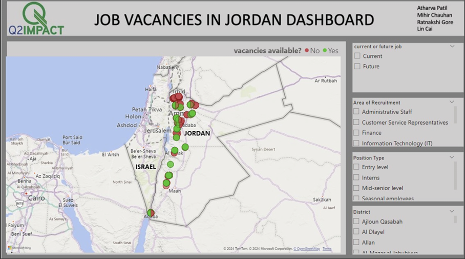
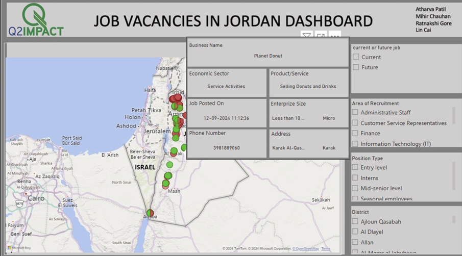
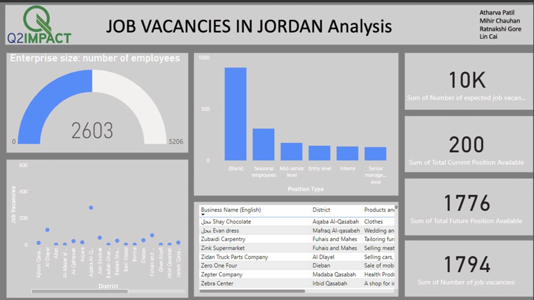

# Job Posting Dashboard for Jordan 🌍

This project was developed during a Data Science Hackathon at my university. The goal was to tackle the challenge of youth unemployment in Jordan by creating an intuitive dashboard using Power BI to help young job seekers easily find relevant job opportunities.

## Problem Statement
Youth in Jordan face difficulties finding job openings tailored to their needs. Our solution was to create a dashboard that visualizes job availability, categorizes opportunities by district, enterprise size, and job role, and simplifies the search process.

---

## Features of the Dashboard 🛠️

1. **Translation of Data:**
   - Original dataset was in Arabic.
   - Translated using Azure's Translate API and Python for better usability.

2. **Data Cleaning & Simplification:**
   - Removed irrelevant columns to reduce complexity.
   - Focused on key columns that provided actionable insights.

3. **Interactive Visualizations:**
   - **Vacancy Availability Map**: Shows job openings by district with easy color-coded markers.
   - **Job Types and Levels**: Categorized opportunities into entry-level, mid-senior, and seasonal roles.
   - **Enterprise Size Analysis**: Visualized enterprise sizes and their corresponding job vacancies.

---

## Key Technologies Used 💻

- **Power BI**: For creating dashboards and visualizations.
- **Python**: For data preprocessing, translation, and integration.
- **Azure Translate API**: To convert Arabic text into English.

---

## Dashboard Preview 📊

### 1. Main Dashboard View


### 2. Secondary Dashboard


### 3. Detailed Analysis


---

## Insights from the Project 📈

- **Job Distribution by District**: Highlighted areas with the most job opportunities, making it easier for job seekers to focus their search.
- **Enterprise Size and Job Role Trends**: Provided insights into which types of organizations were hiring and for what positions.
- **Future Job Openings**: Mapped out positions expected to open in the near future.

---

## How to Run the Project 🚀

1. Clone the repository:
   ```bash
   git clone https://github.com/yourusername/job-posting-dashboard.git
